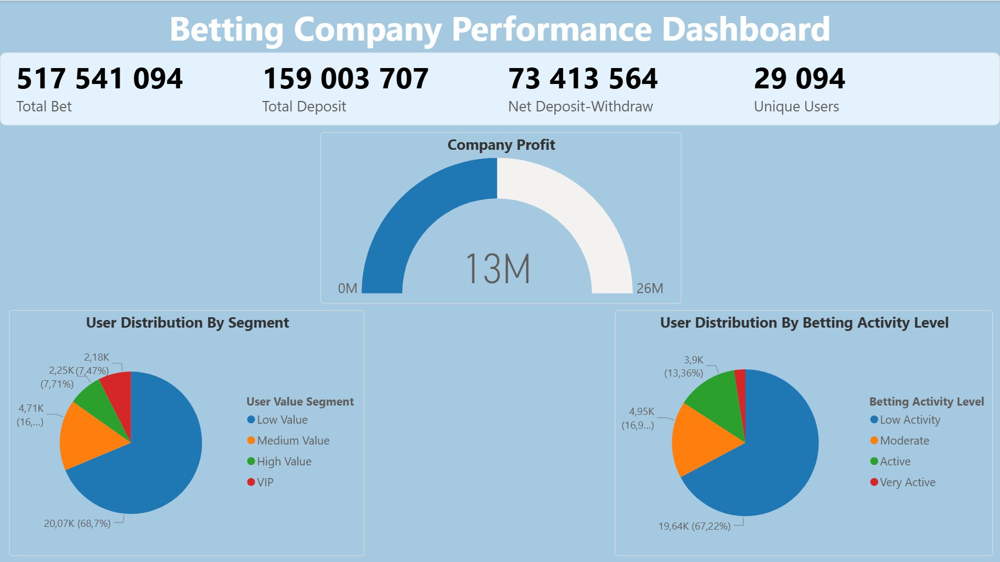
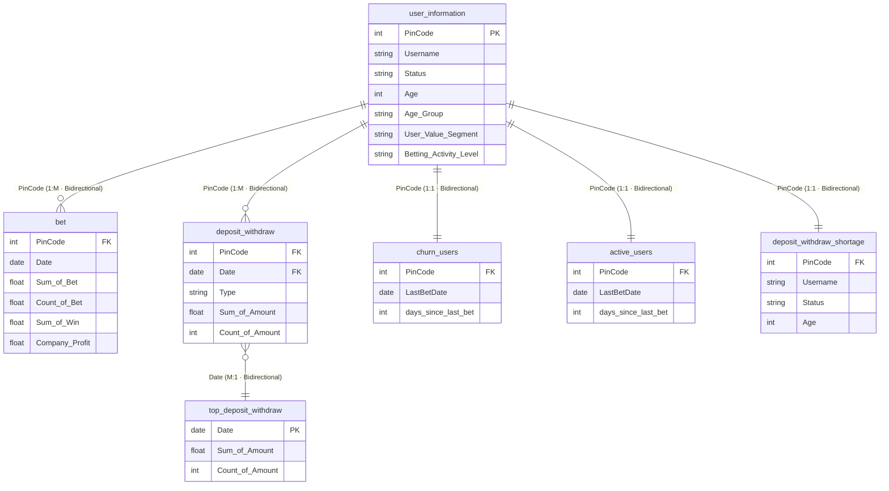

# Lead Data Analysis — Power BI Semantic Model Documentation

> **File:** `lead_data_analysis.pbix`  
> **Compatibility Level:** 1600 (Power BI Enhanced Metadata)  
> **Last Documented:** March 2026  
> **Tables:** 8 visible · 5 hidden (auto-date) · **Measures:** 21 · **Relationships:** 5

---

## Table of Contents

1. [Data Sources](#1-data-sources)
2. [Data Model Overview](#2-data-model-overview)
3. [Table Relationships](#3-table-relationships)
4. [Data Dictionary](#4-data-dictionary)
   - [bet](#41-bet)
   - [deposit_withdraw](#42-deposit_withdraw)
   - [user_information](#43-user_information)
   - [top_deposit_withdraw](#44-top_deposit_withdraw)
   - [churn_users](#45-churn_users)
   - [active_users](#46-active_users)
   - [deposit_withdraw_shortage](#47-deposit_withdraw_shortage)
   - [_Measures](#48-_measures)
5. [Measures Reference](#5-measures-reference)
   - [Betting](#51-betting)
   - [Deposits & Withdrawals](#52-deposits--withdrawals)
   - [Users](#53-users)
   - [Profitability](#54-profitability)
6. [Power Query Transformations](#6-power-query-transformations)

---

## Dashboard Preview

<figure>
  
  <figcaption><em>Betting Company Performance Dashboard — Key KPIs, Company Profit gauge, and User Distribution by Segment and Betting Activity Level</em></figcaption>
</figure>

---

## 1. Data Sources

All data originates from a **single Microsoft Excel workbook** stored on the developer's local machine.

### Source Sheets

| Sheet Name | Loaded Into Table | Notes |
|---|---|---|
| `Deposit & Withdraw` | `deposit_withdraw` | Raw transaction data |
| `User Information` | `user_information` | User profile data |
| `Bet` | `bet` | Daily betting activity |

### Derived Tables (No Direct Source)

Three tables are built entirely within Power Query by transforming the imported tables above — they have no separate file source:

| Table | Derived From | Logic |
|---|---|---|
| `top_deposit_withdraw` | `deposit_withdraw` | Top 10 dates by total deposit/withdrawal volume |
| `churn_users` | `bet` | Users with no bets in the last 60+ days |
| `active_users` | `bet` | Users who placed a bet within the last 7 days |
| `deposit_withdraw_shortage` | `deposit_withdraw` + `user_information` | Users whose July 2023 deposit activity dropped vs prior months |

---

## 2. Data Model Overview

The model follows a **hub-and-spoke** structure with `user_information` as the central dimension table. All fact and analysis tables connect back to it via `PinCode`.

### Table Summary

| Table | Role | Rows (approx.) | Visible |
|---|---|---|---|
| `bet` | Fact — daily betting activity | Many | ✅ |
| `deposit_withdraw` | Fact — financial transactions | Many | ✅ |
| `user_information` | Dimension — user profiles | One per user | ✅ |
| `top_deposit_withdraw` | Summary — top 10 transaction days | 10 | ✅ |
| `churn_users` | Analysis — inactive users | Subset of users | ✅ |
| `active_users` | Analysis — recently active users | Subset of users | ✅ |
| `deposit_withdraw_shortage` | Analysis — July 2023 deposit drop | Subset of users | ✅ |
| `_Measures` | Helper — DAX measure container | 1 (placeholder) | ✅ |
| Auto-date tables (×4) | System — date hierarchies | System-generated | 🚫 Hidden |

---

## 3. Table Relationships



### Relationship Details

| # | From Table | From Column | To Table | To Column | Cardinality | Filter Direction |
|---|---|---|---|---|---|---|
| 1 | `deposit_withdraw` | `PinCode` | `user_information` | `PinCode` | Many → One | ↔ Bidirectional |
| 2 | `bet` | `PinCode` | `user_information` | `PinCode` | Many → One | ↔ Bidirectional |
| 3 | `deposit_withdraw` | `Date` | `top_deposit_withdraw` | `Date` | Many → One | ↔ Bidirectional |
| 4 | `churn_users` | `PinCode` | `user_information` | `PinCode` | One → One | ↔ Bidirectional |
| 5 | `deposit_withdraw_shortage` | `PinCode` | `user_information` | `PinCode` | One → One | ↔ Bidirectional |

> All relationships are **active**. Bidirectional filtering means slicers on `user_information` (e.g. Age Group, Status) will filter all connected tables, and vice versa.

---

## 4. Data Dictionary

### 4.1 `bet`

Daily betting activity per user. Each row represents one user's aggregated bets on a single day. This is the core table for all betting and profitability measures.

| Column | Data Type | Description |
|---|---|---|
| `PinCode` | Integer | Unique user identifier. Foreign key linking to `user_information`. |
| `Date` | Date | The date this betting activity occurred. |
| `Sum of Bet` | Decimal | Pre-aggregated total amount wagered by this user on this date, as summed at the data source. |
| `Count of Bet` | Decimal | Pre-aggregated bet count for this user on this date. Note: contains fractional values — this is a weighted metric, not a simple count. |
| `Sum of Win` | Decimal | Pre-aggregated total amount won by this user on this date. |
| `Company Profit` | Decimal | Net earnings from this user on this date. Calculated in Power Query as `Sum of Bet − Sum of Win`. |

---

### 4.2 `deposit_withdraw`

Every deposit and withdrawal transaction made by users. Each row is pre-aggregated to one user, one date, and one transaction type.

| Column | Data Type | Description |
|---|---|---|
| `PinCode` | Integer | Unique user identifier. Foreign key linking to `user_information`. |
| `Type` | Text | Transaction direction — either `"Deposit"` or `"Withdraw"`. Used to split all financial flow measures. |
| `Date` | Date | The date the transaction took place. Also acts as a foreign key to `top_deposit_withdraw`. |
| `Sum of Amount` | Decimal | Pre-aggregated total monetary value of transactions in this row. |
| `Count of Amount` | Integer | Pre-aggregated count of individual transactions in this row. Range: 1–20. |

---

### 4.3 `user_information`

Profile data for every registered user. Acts as the central dimension in the model — all other tables connect through here.

| Column | Data Type | Description |
|---|---|---|
| `PinCode` | Integer | Unique user identifier. Primary key of this table. |
| `Username` | Text | The user's display name on the platform. |
| `Status` | Text | Current account status (e.g. Active, Inactive, Blocked). |
| `Age` | Integer | User's age in years. Range: 25–67. |
| `Age Group` | Text | Age bracket assigned in Power Query. Values: `25-29`, `30-34`, `35-39`, `40-44`, `45-49`, `50-54`, `55-59`, `60+`. |
| `User Value Segment` *(calculated)* | Text | Lifetime value tier based on total bets. Values: `VIP` (≥50,000) · `High Value` (≥20,000) · `Medium Value` (≥5,000) · `Low Value`. Recalculated on each refresh. |
| `Betting Activity Level` *(calculated)* | Text | Engagement classification based on betting frequency and volume. Values: `Very Active` · `Active` · `Moderate` · `Low Activity`. Recalculated on each refresh. |

---

### 4.4 `top_deposit_withdraw`

A derived summary showing the top 10 dates by combined deposit and withdrawal volume. Used for high-level financial trend visuals. Built entirely from `deposit_withdraw` in Power Query.

| Column | Data Type | Description |
|---|---|---|
| `Date` | Date | The transaction date. Foreign key linking back to `deposit_withdraw`. |
| `Sum of Amount` | Decimal | Total deposit/withdrawal amount across all users on this date. Range: ~2.9M–3.4M. |
| `Count of Amount` | Integer | Total number of transactions on this date. Range: 65,763–76,413. |

---

### 4.5 `churn_users`

A snapshot of users who have gone inactive, defined as **no bets in the last 60 or more days** relative to the most recent date in the `bet` table. Derived in Power Query from `bet`.

| Column | Data Type | Description |
|---|---|---|
| `PinCode` | Integer | Unique user identifier. Foreign key linking to `user_information`. |
| `LastBetDate` | Date | The date of this user's most recent bet. |
| `days_since_last_bet` | Integer | Days elapsed since the last bet. All values ≥ 60 in this table. Range: 60–91. |

---

### 4.6 `active_users`

A snapshot of users who are currently active, defined as **a bet placed within the last 7 days** relative to the most recent date in the `bet` table. Derived in Power Query from `bet`.

| Column | Data Type | Description |
|---|---|---|
| `PinCode` | Integer | Unique user identifier. Foreign key linking to `user_information`. |
| `LastBetDate` | Date | The date of this user's most recent bet. |
| `days_since_last_bet` | Integer | Days elapsed since the last bet. All values 0–7 in this table. |

---

### 4.7 `deposit_withdraw_shortage`

A focused analysis of users who showed a **significant drop in deposit activity during July 2023** compared to their May–June 2023 baseline. Built in Power Query by joining `deposit_withdraw` and `user_information`.

| Column | Data Type | Description |
|---|---|---|
| `PinCode` | Integer | Unique user identifier. Foreign key linking to `user_information`. |
| `Username` | Text | User's display name at the time of analysis. |
| `Status` | Text | User's account status at the time of analysis. |
| `Age` | Integer | User's age at the time of analysis. |
| `2023-05` | Integer | Number of days the user made at least one deposit in May 2023. Baseline reference month 1. Range: 0–31. |
| `2023-06` | Integer | Number of days the user made at least one deposit in June 2023. Baseline reference month 2. Range: 0–30. |
| `Avg_Prior_Deposit_Days` | Decimal | Average deposit days across May and June: `(2023-05 + 2023-06) / 2`. The normal baseline. Range: 0.5–30.5. |
| `July_Deposit_Days` | Integer | Number of days the user deposited in July 2023. Range: 0–30. |
| `Reduction_Pct` | Text | Percentage reduction in deposit activity vs the prior average, formatted as a string (e.g. `"45.00"`). |
| `July_Total_Deposit` | Decimal | Total monetary amount deposited by this user in July 2023. Range: 0–398,132. |

---

### 4.8 `_Measures`

A helper table that exists solely to hold all DAX measures in one organised place. This is a standard Power BI best practice to keep measures separate from data tables. The `Value` column contains a single placeholder row (`{1}`) and is hidden.

---

## 5. Measures Reference

All 21 measures live in the `_Measures` table, organised into four display folders.

---

### 5.1 Betting

#### `Total Bet`
**Business Purpose:** The total amount wagered by users across all bets. The most fundamental indicator of betting volume and platform activity.

```dax
Total Bet = SUM(bet[Sum of Bet])
```

> Sums the pre-aggregated `Sum of Bet` column from the `bet` table across all rows in the current filter context.

---

#### `Total Win`
**Business Purpose:** The total amount paid out to users as winnings. Used alongside Total Bet to understand payout exposure.

```dax
Total Win = SUM(bet[Sum of Win])
```

> Sums the pre-aggregated `Sum of Win` column. Combined with Total Bet, this drives Win Rate % and Company Profit.

---

#### `Total Bet Count`
**Business Purpose:** The total number of individual bets placed. Measures betting frequency independent of monetary value — a user placing many small bets will score high here.

```dax
Total Bet Count = SUM(Bet[Count of Bet])
```

> Sums the `Count of Bet` column. Note: this column contains fractional values in the source data, indicating it is a weighted pre-aggregation rather than a simple integer count.

---

#### `Win Rate %`
**Business Purpose:** The percentage of wagered money returned to users as winnings. A Win Rate of 90% means users won back 90 cents for every dollar wagered. Higher values indicate more generous payouts to users.

```dax
Win Rate % = DIVIDE([Total Win], [Total Bet], 0) * 100
```

> Divides Total Win by Total Bet, then multiplies by 100 to express as a percentage. Returns 0 if Total Bet is blank or zero (safe division).

---

#### `Avg Bet per User`
**Business Purpose:** Average amount wagered per unique active user. Useful for identifying whether revenue growth is driven by more users or by existing users betting more.

```dax
Avg Bet per User = DIVIDE([Total Bet], [Unique Users], 0)
```

> Divides total betting volume by the number of distinct users. Returns 0 if there are no users in context.

---

#### `Bet to Deposit Ratio`
**Business Purpose:** How much users are betting relative to what they deposited. A low ratio (green) means users are betting conservatively. A high ratio (red) may indicate users are recycling winnings heavily. The special value 999 flags users who bet without making any deposit at all.

```dax
Bet to Deposit Ratio =
    IF(
        [Total Deposit] > 0,
        DIVIDE([Total Bet], [Total Deposit], BLANK()),
        IF(
            [Total Bet] > 0,
            999,
            BLANK()
        )
    )
```

> **Colour-coding guide:** Green = ratio < 2 · Yellow = 2–5 · Red = ratio > 5 · `999` = bet activity with no deposit (display as "No Deposit" in visuals). Returns BLANK if there is no activity at all.

---

#### `Activity Score`
**Business Purpose:** A composite index that measures overall platform engagement by combining betting volume, deposit behaviour, bet frequency, and user count into a single score. Higher scores indicate more active periods or segments.

```dax
Activity Score =
    ([Total Bet] * 0.4) +
    ([Total Deposit] * 0.3) +
    ([Total Bet Count] * 0.2) +
    ([Unique Users] * 10)
```

> Weighted formula: **40%** betting volume + **30%** deposits + **20%** bet frequency + user count × 10. The user count multiplier (×10) is a scale adjustment to make user count comparable in magnitude to monetary values.

---

#### `Activity Level`
**Business Purpose:** A human-readable classification of the current filter context (e.g. a user or time period) into one of four engagement tiers, based on how often and how much betting occurred.

```dax
Activity Level =
VAR DaysBet = COUNTROWS(Bet)
VAR AvgDailyBet = [Total Bet] / DaysBet
RETURN
    SWITCH(
        TRUE(),
        DaysBet >= 40 && AvgDailyBet >= 1000, "Very Active",
        DaysBet >= 20, "Active",
        DaysBet >= 10, "Moderate",
        "Low Activity"
    )
```

> First counts the number of rows in the `bet` table in context (proxy for betting days), then calculates average daily bet size. **Very Active** requires both high frequency (40+ days) AND high value (avg ≥ 1,000). The remaining tiers depend only on frequency.

---

### 5.2 Deposits & Withdrawals

#### `Total Deposit`
**Business Purpose:** Total money deposited onto the platform by users. The primary indicator of cash inflow.

```dax
Total Deposit =
CALCULATE(
    SUM(Deposit_Withdraw[Sum of Amount]),
    Deposit_Withdraw[Type] = "Deposit"
)
```

> Uses `CALCULATE` to override the filter context and restrict the sum to rows where `Type = "Deposit"`. Ignores withdrawal rows.

---

#### `Total Withdraw`
**Business Purpose:** Total money withdrawn from the platform by users. The primary indicator of cash outflow.

```dax
Total Withdraw =
CALCULATE(
    SUM(deposit_withdraw[Sum of Amount]),
    deposit_withdraw[Type] = "Withdraw"
)
```

> Same logic as Total Deposit, but filters to `Type = "Withdraw"`.

---

#### `Net Deposit-Withdraw`
**Business Purpose:** The net cash position — how much more money came in than went out. A positive value is healthy (users depositing more than withdrawing). A negative value warrants attention.

```dax
Net Deposit-Withdraw = [Total Deposit] - [Total Withdraw]
```

> Simple subtraction of the two measures above. Inherits their filter context automatically.

---

#### `Deposit Count`
**Business Purpose:** The total number of individual deposit transactions. Distinguishes between deposit frequency and deposit value — useful for understanding user deposit habits.

```dax
Deposit Count =
CALCULATE(
    SUM(Deposit_Withdraw[Count of Amount]),
    Deposit_Withdraw[Type] = "Deposit"
)
```

> Filters to deposit rows and sums the `Count of Amount` column, which holds the pre-aggregated transaction count from the source.

---

#### `Withdraw Count`
**Business Purpose:** The total number of individual withdrawal transactions.

```dax
Withdraw Count =
CALCULATE(
    SUM(Deposit_Withdraw[Count of Amount]),
    Deposit_Withdraw[Type] = "Withdraw"
)
```

> Same pattern as Deposit Count, filtered to `Type = "Withdraw"`.

---

#### `Avg Deposit per User`
**Business Purpose:** Average deposit amount per user who actually deposited. Unlike dividing by all users, this reflects the true value of depositing users and helps benchmark against acquisition costs.

```dax
Avg Deposit per User = DIVIDE([Total Deposit], [Unique Deposit Users], 0)
```

> Divides total deposits by the count of distinct depositing users (not all users). Returns 0 if there are no depositing users in context.

---

#### `Unique Deposit Users`
**Business Purpose:** The number of distinct users who made at least one deposit. Useful for measuring deposit penetration across the user base.

```dax
Unique Deposit Users =
CALCULATE(
    DISTINCTCOUNT(Deposit_Withdraw[PinCode]),
    Deposit_Withdraw[Type] = "Deposit"
)
```

> Filters to deposit-type rows, then counts unique `PinCode` values. A user depositing multiple times is counted only once.

---

### 5.3 Users

#### `Unique Users`
**Business Purpose:** The number of distinct users who placed at least one bet. This is the primary active user count for the platform — the core audience metric.

```dax
Unique Users = DISTINCTCOUNT(Bet[PinCode])
```

> Counts unique `PinCode` values in the `bet` table within the current filter context. A user with 100 bets still counts as 1.

---

#### `Churn Users Count`
**Business Purpose:** The number of users who have effectively gone dormant — no betting activity for 60 or more consecutive days. A leading indicator of user retention risk.

```dax
Churn Users Count =
VAR LastDateInData = MAX(Bet[Date])
VAR ChurnThreshold = 60
RETURN
COUNTROWS(
    FILTER(
        SUMMARIZE(
            Bet,
            Bet[PinCode],
            "LastBetDate", MAX(Bet[Date])
        ),
        DATEDIFF([LastBetDate], LastDateInData, DAY) >= ChurnThreshold
    )
)
```

> **Step by step:**
> 1. Finds the most recent date in the entire `bet` table (`LastDateInData`)
> 2. Summarises the table to get each user's most recent bet date
> 3. Filters to users whose last bet was 60 or more days before `LastDateInData`
> 4. Counts those users
>
> The **60-day threshold** is hardcoded in the `ChurnThreshold` variable — change this value to adjust the churn definition.

---

#### `User Value Segment`
**Business Purpose:** Classifies the current user or filter context into a value tier based on total lifetime betting volume. Mirrors the calculated column of the same name in `user_information` but works dynamically in visuals and responds to slicer selections.

```dax
User Value Segment =
VAR TotalUserBet =
    CALCULATE(
        SUM('bet'[Sum of Bet]),
        ALLEXCEPT('bet', 'bet'[PinCode])
    )
RETURN
    SWITCH(
        TRUE(),
        TotalUserBet >= 50000, "VIP",
        TotalUserBet >= 20000, "High Value",
        TotalUserBet >= 5000, "Medium Value",
        "Low Value"
    )
```

> Uses `ALLEXCEPT` to remove all filters except `PinCode`, ensuring the total bet amount is always the user's lifetime figure regardless of date slicers. Then maps to a tier using `SWITCH(TRUE(), ...)` — the first condition that evaluates to TRUE wins.

---

#### `Shortage User Count`
**Business Purpose:** Count of users identified in the July 2023 deposit shortage analysis — i.e. users who meaningfully reduced their deposit activity in July compared to prior months.

```dax
Shortage User Count =
CALCULATE(
    COUNT('deposit_withdraw_shortage'[Status])
)
```

> Counts non-blank `Status` entries in the `deposit_withdraw_shortage` table. Since every row represents one flagged user, this equals the number of users in the shortage analysis.

---

### 5.4 Profitability

#### `Company Profit`
**Business Purpose:** The company's net earnings from betting activity — money wagered by users minus money paid out as winnings. The core bottom-line metric.

```dax
Company Profit = SUM(bet[Company Profit])
```

> Sums the `Company Profit` column from the `bet` table. This column is pre-calculated in Power Query as `Sum of Bet − Sum of Win` per row, so this measure simply aggregates it across the filter context.

---

#### `Deposit Target`
**Business Purpose:** A fixed performance benchmark for total deposits, set at **15,000,000**. Used as a reference line in deposit visuals to show how actual deposit volumes compare against the business goal.

```dax
Deposit Target = 15000000
```

> Returns a constant value of 15,000,000. Used as a static target line. To update the target, change this value directly in the DAX expression.

---

## 6. Power Query Transformations

### 6.1 `deposit_withdraw` — Direct from Excel

**Source:** `"Deposit & Withdraw"` sheet in the Excel workbook.

| Step | Description |
|---|---|
| Load workbook | Opens the Excel file and reads all sheets |
| Select sheet | Navigates to the `Deposit & Withdraw` sheet |
| Promote headers | Treats the first row as column names |
| Select columns | Keeps only: `PinCode`, `Type`, `Date`, `Sum of Amount`, `Count of Amount` |
| Set data types | `PinCode` → Int64 · `Sum of Amount` → Number · `Date` → Date · `Type` → Text · `Count of Amount` → Int64 (locale: `en-US`) |
| Remove blank rows | Drops any row where all values are empty or null |

---

### 6.2 `user_information` — Direct from Excel

**Source:** `"User Information"` sheet in the Excel workbook.

| Step | Description |
|---|---|
| Load workbook | Opens the Excel file |
| Select sheet | Navigates to `User Information` |
| Promote headers | First row becomes column names |
| Select columns | Keeps: `PinCode`, `Username`, `Status`, `Age` |
| Set data types | `Username`, `Status` → Text · `Age`, `PinCode` → Int64 |
| Remove blank rows | Two passes: removes rows with all-null/empty values, then filters out empty `Username` rows |
| Add Age Group | Custom column added using nested `if/else` logic: `<30 → "25-29"` · `<35 → "30-34"` · … · `≥60 → "60+"` |

---

### 6.3 `bet` — Direct from Excel

**Source:** `"Bet"` sheet in the Excel workbook.

| Step | Description |
|---|---|
| Load workbook | Opens the Excel file |
| Select sheet | Navigates to `Bet` |
| Promote headers | First row becomes column names |
| Initial type cast | Casts all columns; extra columns (`Column6`, `Column7`, Georgian-named columns) included at this stage |
| Select columns | Trims down to: `PinCode`, `Date`, `Sum of Bet`, `Count of Bet`, `Sum of Win` |
| Re-cast types | `PinCode` → Int64 · `Date` → Date · numeric columns → Number (locale: `en-US`) |
| Remove blank rows | Drops rows with all-null/empty values |
| Add Company Profit | Custom column: `[Sum of Bet] - [Sum of Win]` — the per-row company margin |
| Set type | `Company Profit` → Number |

> **Note:** The source sheet contains extra columns with Georgian-language names that are dropped in the Select Columns step. These appear to be raw labels from the original data extraction.

---

### 6.4 `top_deposit_withdraw` — Derived from `deposit_withdraw`

**Source:** The already-loaded `deposit_withdraw` table (no file read).

| Step | Description |
|---|---|
| Reference source | Uses `deposit_withdraw` as input — no additional file connection |
| Group by Date | Aggregates all rows per date: sums `Sum of Amount`, sums `Count of Amount` |
| Sort descending | Orders by `Sum of Amount` highest first |
| Keep top 10 | Retains only the first 10 rows — the 10 busiest deposit/withdrawal dates |

> This table gives a clean top-10 view of the highest-activity financial days, useful for spotlight visuals without loading the full transaction history.

---

### 6.5 `churn_users` — Derived from `bet`

**Source:** The already-loaded `bet` table.

| Step | Description |
|---|---|
| Reference source | Uses `bet` as input |
| Find max date | Stores the most recent date in the entire `bet` table as `MaxDate` |
| Group by PinCode | Collapses to one row per user, taking the maximum (most recent) `Date` as `LastBetDate` |
| Add days column | Calculates `Duration.Days(MaxDate - LastBetDate)` — days since their last bet |
| Filter | Keeps only users where `days_since_last_bet >= 60` |

---

### 6.6 `active_users` — Derived from `bet`

**Source:** The already-loaded `bet` table.

Identical pipeline to `churn_users`, with one difference in the final filter step:

| Step | Description |
|---|---|
| Filter | Keeps only users where `days_since_last_bet <= 7` (bet within the last week) |

> Together, `churn_users` and `active_users` segment the full user base into opposite ends of the engagement spectrum. Users between 8–59 days fall into neither table — they are the "at-risk" middle ground.

---

### 6.7 `deposit_withdraw_shortage` — Derived from `deposit_withdraw` + `user_information`

**Source:** `deposit_withdraw` and `user_information` tables. The most complex transformation in the model.

| Step | Description |
|---|---|
| Filter deposits | Keeps only `Type = "Deposit"` rows from `deposit_withdraw` |
| Add Month column | Formats each date as `"yyyy-MM"` (e.g. `"2023-07"`) |
| Group by user + month | Counts distinct deposit days per user per month (`Deposit_Days`) |
| Pivot months | Rotates month values into columns: `2023-05`, `2023-06`, `2023-07` |
| Replace nulls | Fills blanks with `0` for all three month columns |
| Rename July | Renames `2023-07` → `July_Deposit_Days` for clarity |
| Add Avg Prior | `(2023-05 + 2023-06) / 2` — the baseline deposit frequency |
| Filter reduced users | Keeps only users where: (1) they had prior deposit activity, AND (2) their July days are below their prior average |
| Add Reduction % | `(Avg_Prior - July_Deposit_Days) / Avg_Prior × 100`, rounded to 2 decimal places |
| Join user_information | Left outer join on `PinCode` to pull in `Status`, `Age`, `Username` |
| Calculate July amounts | Separately filters deposit rows to July 2023, groups by user, sums total deposit value |
| Join July amounts | Left outer join on `PinCode` to add `July_Total_Deposit` |
| Replace null deposits | Users with zero July deposits get `0` instead of null |
| Select final columns | Reorders to: `PinCode`, `Username`, `Status`, `Age`, `2023-05`, `2023-06`, `Avg_Prior_Deposit_Days`, `July_Deposit_Days`, `Reduction_Pct`, `July_Total_Deposit` |

> This table is a self-contained analytical dataset. Every row is a user who was active in May/June 2023 but deposited less frequently in July 2023 — making it ready-to-use for churn risk and revenue recovery analysis.

---
